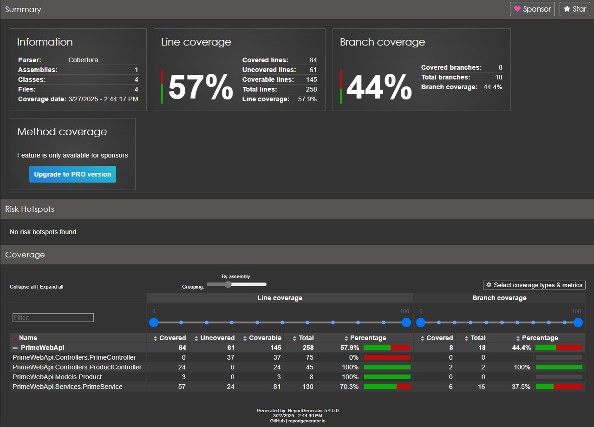
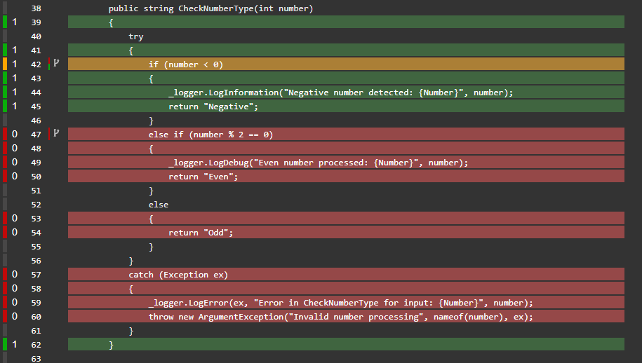
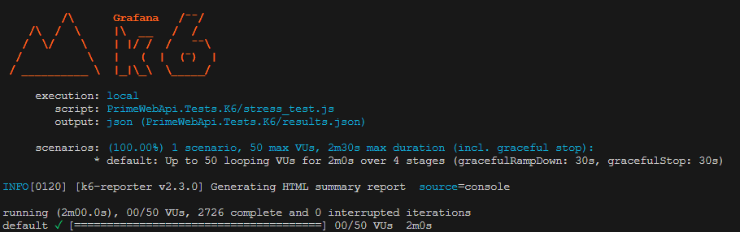
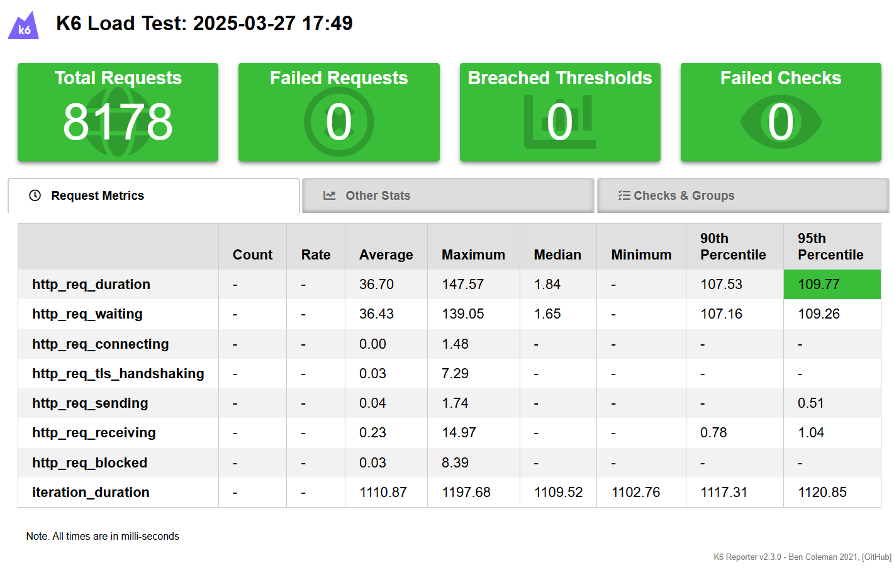
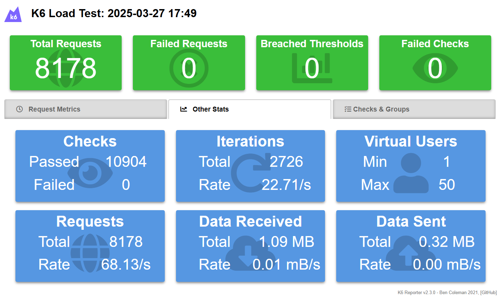

# DotnetApisTestBase

A practical .NET API project demonstrating essential testing methodologies:

## 🎯 Project Focus

- 🧪 **Unit Testing Fundamentals with xUnit**
   - Learn how to write effective xUnit tests  
   - Mock dependencies with Moq  
   - Test controllers and services in isolation  

- 📊 **Code Coverage & Analysis with Coverlet + ReportGenerator**
   - Measure test coverage with Coverlet  
   - Generate interactive HTML reports  
   - Exclude non-testable code (e.g., Program.cs)  

- ⚡**Load & Stress Testing  with k6** 
   - Simulate user traffic with k6  
   - Identify performance bottlenecks  
   - Observe system behavior under extreme loads  

- 📈 **Visual Reporting (HTML & Grafana)**   
   - View coverage trends in HTML/Grafana  
   - Analyze stress test metrics  
   - Track performance regressions  


## Why This Matters
This project serves as both:  
- A **learning resource** for .NET testing best practices  
- A **template** for real-world testable API development 

A .NET 6 API testing showcase covering:

| Aspect            | Tools Used          | Key Learnings |
|-------------------|---------------------|---------------|
| Unit Testing      | xUnit, Moq          | Isolated component tests |
| Code Coverage     | Coverlet, ReportGenerator | Coverage metrics, exclusions |
| Load Testing      | k6                  | Ramp-up/spike scenarios |
| System Observability | Grafana         | Performance visualization |


**Educational Value**:  
Demonstrates how to implement a complete testing - from individual unit tests to full-system stress tests.

## Project Structure

```
DotnetApisTestBase/
├── PrimeWebApi/                     # Main API
│   ├── Controllers/                 # API endpoints
│   ├── Services/                    # Business logic
│   ├── Program.cs                   # Entry point (excluded from coverage)
│   └── PrimeWebApi.csproj          
├── PrimeWebApi.Tests/               # Unit tests
│   ├── PrimeServiceTests.cs         # Service layer tests
│   ├── ProductControllerTests.cs    # API endpoint tests
│   └── PrimeWebApi.Tests.csproj    
├── PrimeWebApi.Tests.K6/            # Load tests (k6 scripts)
│   └── stress_test.js              
├── TestResults/                     # Raw coverage data (auto-generated)
├── CoverageReport/                  # HTML coverage (auto-generated)
└── PrimeWebApi.sln                 
```

---

## 🧪 Unit Testing & Coverage
### 1. Run Tests with Coverage
```powershell
cd DotnetApisTestBase
dotnet clean
dotnet build
dotnet test --collect:"XPlat Code Coverage" --results-directory TestResults
```
### 2. Generate HTML Report
```
# Install as global .NET tool
dotnet tool install --global dotnet-reportgenerator-globaltool

# Verify installation
reportgenerator --version

# Report generation
reportgenerator -reports:"TestResults/coverage.cobertura.xml" -targetdir:"CoverageReport" -reporttypes:Html

# Open the report
start CoverageReport/index.html
```

## 📊 Test Coverage Report
Here's how the coverage report looks:




## 📊 Partially covered code
Here's how it looks:




## 📊 Load/Stress Testing (k6)
### 1. Run Tests with Coverage

# Install k6 (choose one)
```
winget install k6  # Windows
brew install k6    # macOS
sudo apt-get install k6  # Linux
```

# Optional: HTML reporter
```
npm install -g k6-html-reporter
```

# Generate Report
```
k6 run --out json=PrimeWebApi.Tests.K6/results.json PrimeWebApi.Tests.K6/stress_test.js
start PrimeWebApi.Tests.K6/report.html
```

## 📊 k6 In Terminal
Here's how it looks:




## 📊 k6 Report
Here's how it looks:







## 🔍 Key References
| Tool      | Documentation |
|-----------|---------------|
| 🧪 xUnit    | [Official Docs](https://xunit.net/) |
| 📊 Coverlet | [GitHub Repo](https://github.com/coverlet-coverage/coverlet) |
| ⚡ k6       | [k6 Learning](https://k6.io/docs/) |
| 📈 Grafana  | [Documentation](https://grafana.com/docs/) |